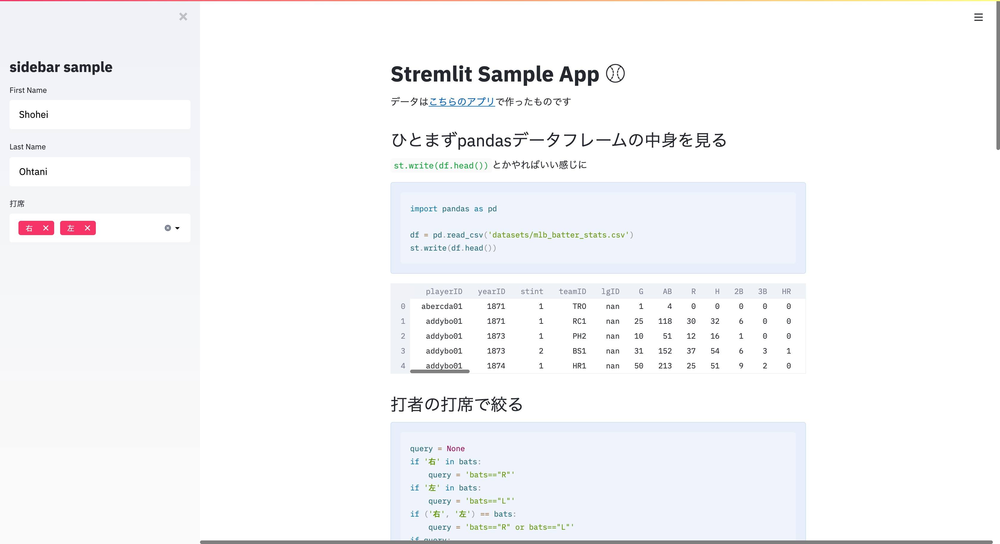

# Streamlit Sample Application :baseball:

[Streamlit](https://www.streamlit.io/)をサクッと使うためのサンプルアプリケーションです.



## install

### local

```bash
$ python3 -m venv venv
$ source venv/bin/activate
(venv) $ pip install -r requirements.txt
```

## Usage

### local

```bash
(venv) $ stremlit run sample_app.py
```

# Maintainer

[@shinyorke(Shinichi-Nakagawa)](https://github.com/Shinichi-Nakagawa)